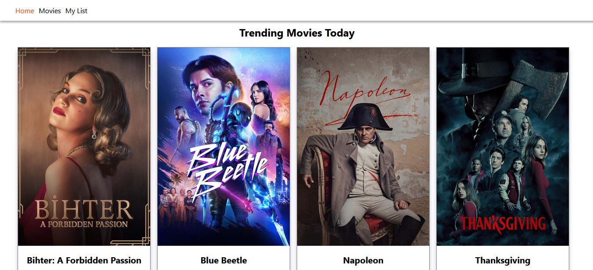
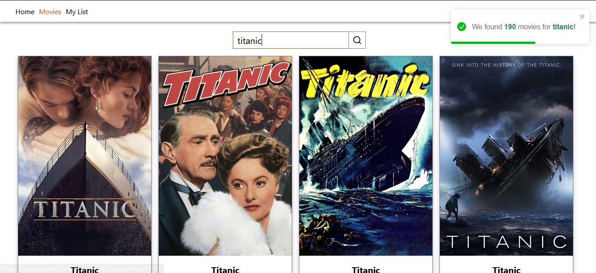
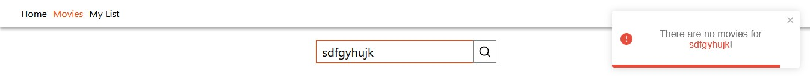
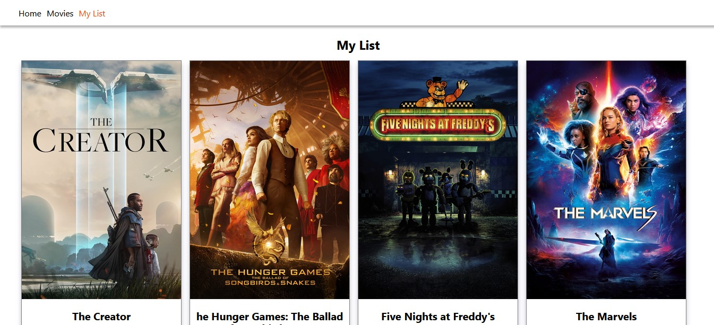
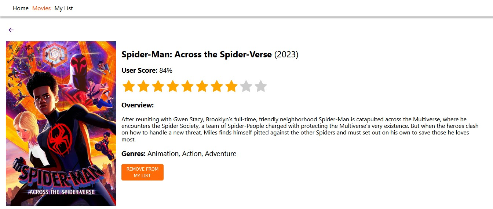
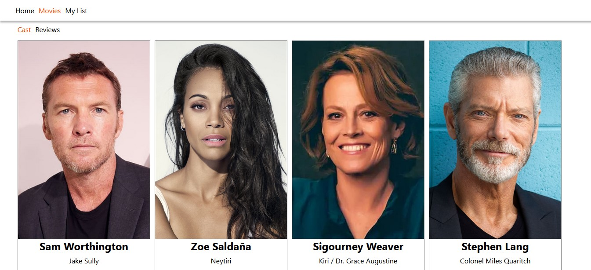
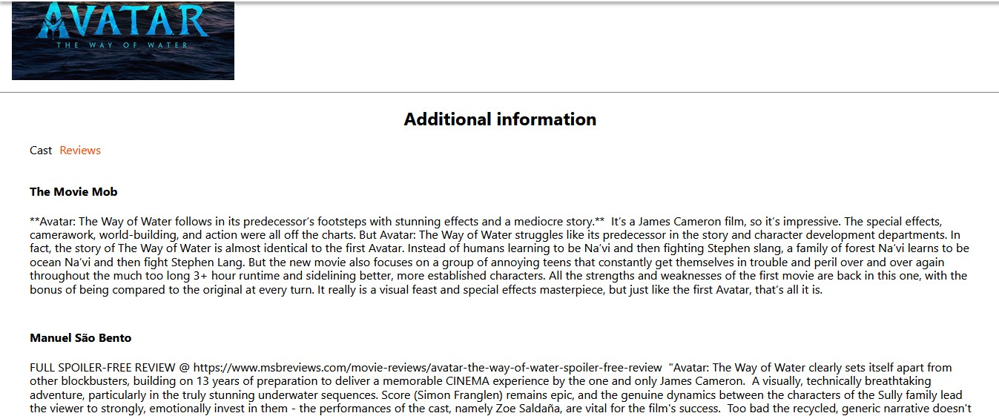

# Movie App

This project is a React application for browsing and searching movies. It
utilizes [The Movie Database (TMDb) API](https://developer.themoviedb.org/docs)
to fetch movie data. Users can view trending movies, search for movies, view
movie details, and add movies to their personal list.

## Features

- Home (Trending Movies): The home page displays trending movies for today,
  loaded with infinite scrolling. 

- Search Movies Page: Allows users to search for movies by entering a query.
  Search results are paginated and loaded dynamically.
   

- My List Page: Displays a list of favorite movies added by the user. Movies can
  be added or removed from the list. 

- Movie Details Page: Provides detailed information about a selected movie,
  including its overview, user score, genres, additional information tabs for
  cast and reviews, and the option to add or remove from the list of favorites.
   
  

## Dependencies

    axios: HTTP client for making API requests.
    react: JavaScript library for building user interfaces.
    react-dom: React package for working with the DOM.
    react-icons: A library for including popular icons in React applications.
    react-infinite-scroll-component: Infinite scroll component for React.
    react-loading-skeleton: Skeleton loader for loading content.
    react-router-dom:  Handles navigation and routing in React applications.
    react-toastify: Notification library for React.
    styled-components: Library for styling React components with tagged template literals.

## Contributing

Feel free to contribute to this project by opening issues or pull requests.
